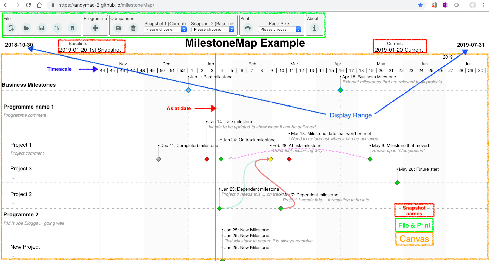
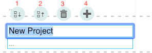
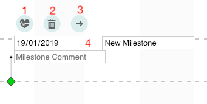
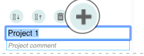
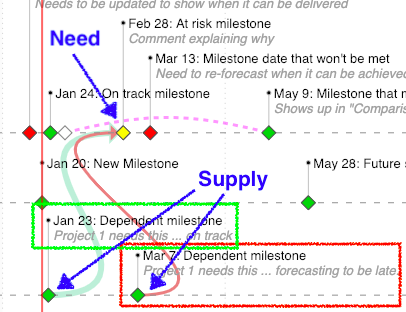
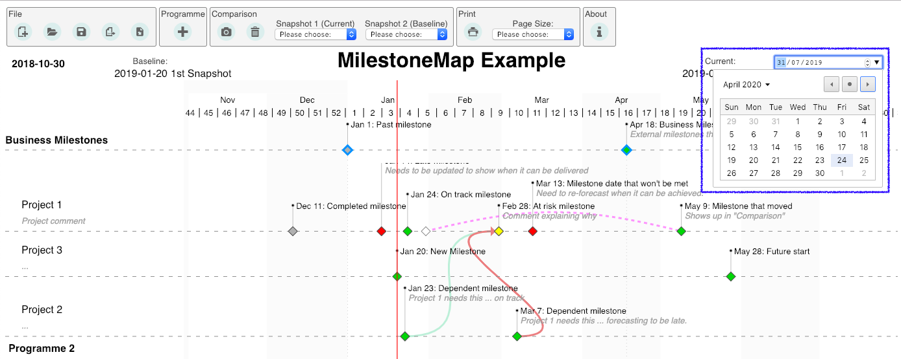
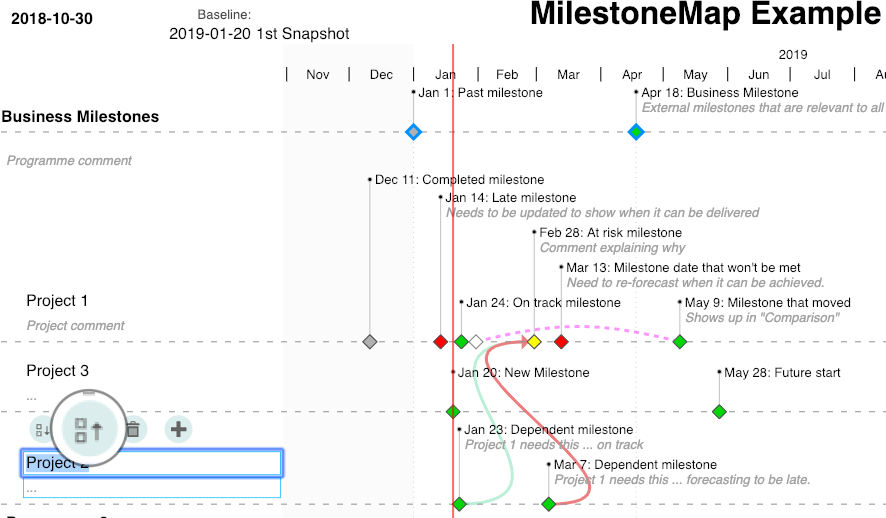

# Overview
## What problem are we were trying to solve?
For a Programme Manager working in the IT delivery space what we want to monitor (and communicate consistently) at the high level is:
1. What the projects and programmes are delivering and when (Milestones)?
2. How confident are we that we will meet that delivery (Health)?
3. Is the delivery reliant on anything else (Dependency)?
4. What has changed (Compare)?

What we don't want to do is constantly have to draw up slides to reflect this to our stakeholders.

milestoneMap was developed to capture and report on this information and do comparisons between the status at 2 different dates.

# User Guide
## Set Up
milestoneMap can be installed locally or run from GitHub (recommended).

To run from GitHub use the following URL [https://andymac-2.github.io/milestoneMap/](https://andymac-2.github.io/milestoneMap/)

## Basics
MilstoneMap displays a canvas where business/customer and project milestones can be represented. The period being displayed can be as large or small as required. You are not restricted to entering to just the display view. 

This allows for long term and short terms views to be generated.

The image below provides a summary of the key components of a MilestonMap.



### Basic screen controls
#### File and print management

At the top of the screen are the controls for file management, snapshot management and printing.


**File Controls**

Lets you manage the file the data for milestone map is contained in.

1. Create new map. Creates a *.JSON file.
2. Open existing map.
3. Save open file.
4. Export base data to *.csv file
5. Import data from a *.csv file.

**Programme Control**

6. Create a programme heading.

**Comparison Controls**

Comparisons allow you to show the differences (and movements) of milestones between 2 points in time (snapshots). E.g.compare "last month" to "now" or compare "last month" to "6 months ago".

7. Take a snapshot of the current status.
8. Delete a snapshot.
9. Current snapshot selection (defaults to the current view).
10. Baseline snapshot. The snapshot you want to compare to.

**Print Controls**

Print the map. There are various pre-defined layouts.

11. Print the milestone map
12. Pre-defined outputs for the milestone map


**About**

13. Version details, help and logging issues for defects or enhancements.

#### Programme/Project Controls
Both the programme and project entries have the same common controls



1. Shift programme/project down one.
	Shifting a programme moves all of the projects in side as well.
	Shifting a project also allows you to move across to a different programme group.	
2. Shift programme/project up one.
3. Delete programme/project.
4. Add project/milestone.
	If this is selected for a Programme it will create a "project line.
	If this is selected for a Project it will create a Milestone as at today's date.

#### Milestone Controls



1. Milestone health. This cycles through:
	1.1 Green (on-track), 
	1.2 Yellow (at-risk), 
	1.3 Red (late) and 
	1.4 Grey (complete).
2. Deletes the milestone.
3. Add dependency. Adds a dependency line to another milestone that is dependent (needs) the current milestone to have been met.
4. Date of milestone. 

### Creating a milestoneMap
Creating a milestone Map is as simple as saving the file. 


1. Change the title by selecting the "New Map" text at the top of the page. This will be the name of the .JSON file that is created when you select the "Save" option.


2. Select "Save".


*Note! Depending on your browser settings you may have different ways presented to you to save the JSON file. Consider if you want to save copies as you progress or maintain a single file that you overwrite each time.*

	e.g. Chrome has settings to prompt for the overwriting or not.

### Create/Update a Programme
The concept of "programme" in MilestoneMap is merely a collection of projects. It does not need to reflect an actual programme. It can reflect parts of a programme. The primary advantage is that the contents of the "programme" can me moved up and down as a group (see "Moving projects and programmes"

To create a programme:

1. Select the "+" icon which will append a programme group to the canvas.


2. Enter a name for the programme grouping.


### Create/Update a Project
To create a project entry:
1. Select the Programme grouping. This will display the Programme controls.
2. Select the "+" icon. This will append a new project line to the list of projects in the programme.


### Create/Update a Milestone
To create a Milestone entry:
1. Select the Project. This will display the project controls.
2. Select the "+" icon. This will add a new milestone line to the project with default date of today.



### Create a Dependency
To create a dependency:

1. Select the milestone that is "supplying". I.e. Delivering something another project needs.
2. Select the dependency icon.


3. Click on the milestone that "needs". I.e. It needs the supply milestone.


If the "supply" milestone is on the same date or before of the "need" milestone it will show as green (OK). 
If the "supply" milestone is after the "need" milestone it will show as red (late).




### Printing
To print:

1. Select the output format.
2. Click on the print icon.


### Change the date span
Changing the date range displayed is done by changing the "Display Range" vaults on either side of the screen.



..results in ...


### Moving projects and programmes.
Projects can be moved up or down using the "Shift Up" and "Shift Down" controls



..results in ...

*Note! In the above example the project entry was moved up 2 slots.*

## Beyond Basics
### Import and Export Data
### Working with a Team
### Snapshots and Comparisons

# Troubleshooting
## Known issues
## Requesting Support

# help file

1. this is a list
2. this is the second item

## subheading

add headers to make smaller headings.

How to make *italics* and **bold** text

How to write [links](google.com)

```
this is how you write preformetted text
great for code
hello
```


